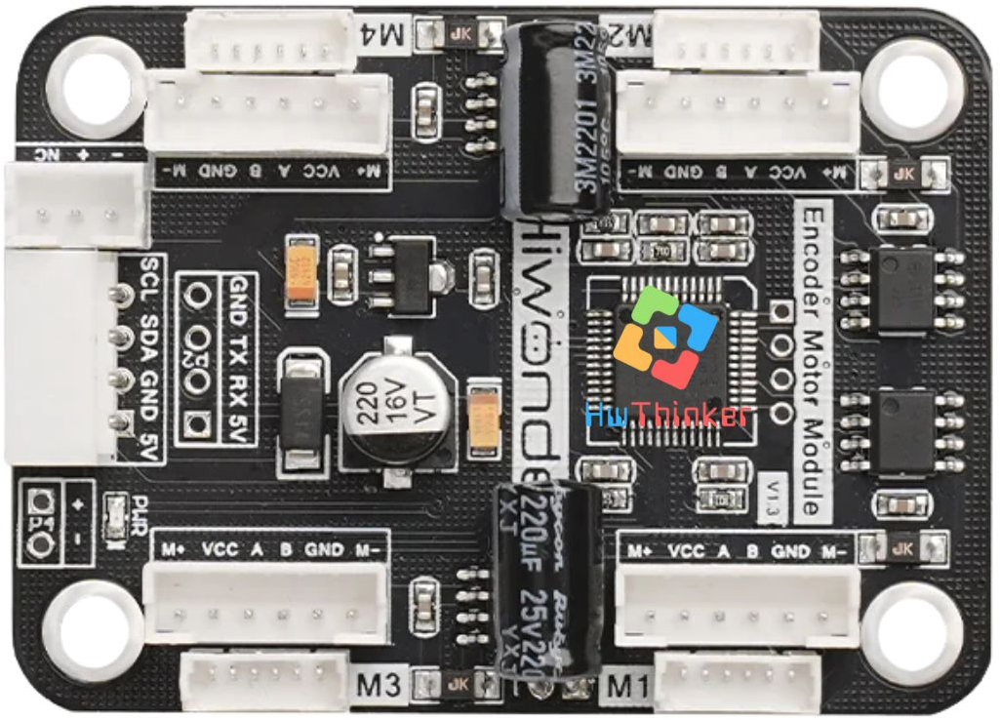
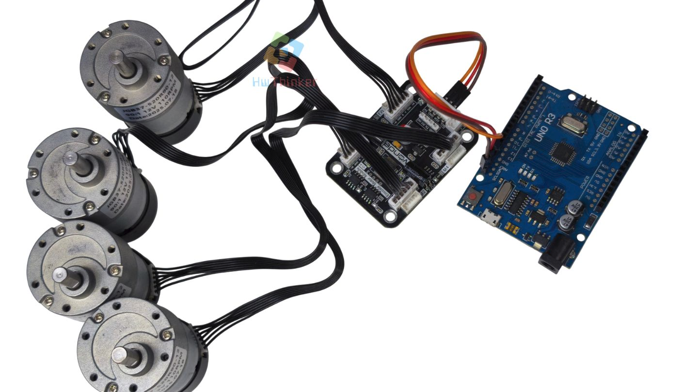
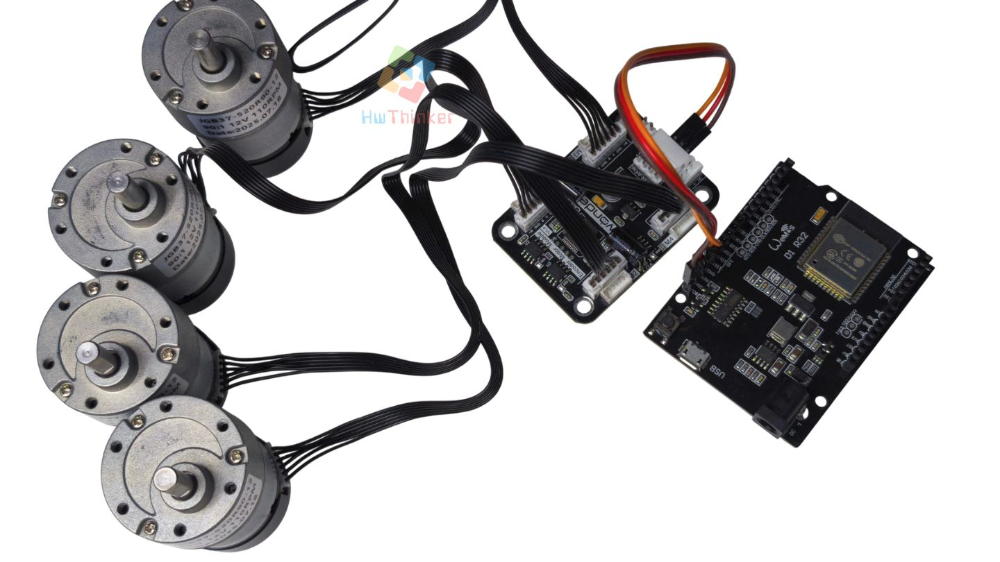
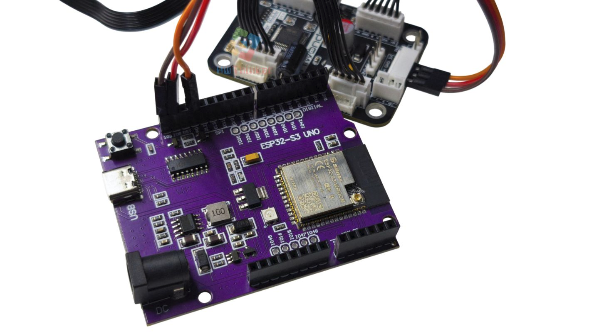

# Hwonder-4-Channel-Encoder



**Deskripsi Produk: 4-Channel Encoder Motor Driver SA8339 – Cocok untuk Robot & Proyek Elektronik**

Ingin membangun robot atau proyek elektronik yang presisi dan responsif? Gunakan **4-Channel Encoder Motor Driver SA8339**, modul penggerak motor yang kuat dan fleksibel, cocok untuk berbagai jenis mikrokontroler dan motor encoder yang banyak beredar di pasaran.

**Fitur Utama:**

- Menggunakan chip motor driver SA8339 berkinerja tinggi, stabil, dan efisien.
- Dapat mengendalikan hingga 4 motor DC encoder secara bersamaan.
- Kompatibel dengan berbagai kontroler seperti STM32, Arduino, Raspberry Pi 4/5, dan Jetson Nano.
- Mendukung motor encoder TT DC, serta motor gearbox 520 dan 310 yang umum digunakan di robot mobil DIY.
- Cocok untuk lomba robotik, proyek pendidikan, atau sistem otomasi kecil.
- Dilengkapi proteksi terhadap sambungan terbalik agar lebih aman digunakan.

**Spesifikasi Teknis:**

- Chip Driver: SA8339
- Tegangan suplai (VM): 5V–15V
- Arus keluaran per kanal: 2A (maksimum puncak 2.5A)
- Output daya tambahan: 5V (1A), 3.3V
- Tegangan logika sinyal Hall: 3.3V / 5V
- Proteksi: Perlindungan terhadap sambungan daya terbalik
- Kompatibilitas: STM32, Arduino, Raspberry Pi, Jetson Nano, dan lainnya

**Port & Koneksi:**

- Encoder: A (sinyal fase A), B (sinyal fase B), VCC, GND
- Motor: M+, M-
- Daya: + (positif), - (negatif)
- I2C: SCL (clock), SDA (data)

**Aplikasi Penggunaan:**

- Mobil robot cerdas dengan sistem kendali encoder
- Proyek otomasi DIY dan pembelajaran mikrokontroler
- Sistem kontrol motor untuk lomba robotik
- Pengembangan produk berbasis Raspberry Pi atau Jetson Nano

**Keunggulan Produk:**

- Desain compact dan mudah diintegrasikan
- Performa stabil untuk berbagai jenis motor encoder
- Mendukung komunikasi data yang akurat untuk kontrol presisi
- Dapat digunakan untuk eksperimen, prototipe, hingga aplikasi nyata


### Testing Arduino UNO



#### program testing Uno

```c++
#include <Wire.h>

#define I2C_ADDR        0x34

#define ADC_BAT_ADDR                  0x00
#define MOTOR_TYPE_ADDR               0x14 // Pengaturan tipe motor encoder
#define MOTOR_ENCODER_POLARITY_ADDR   0x15 // Pengaturan polaritas arah encoder
// Jika kecepatan motor sama sekali tidak bisa dikontrol — entah berputar secepat mungkin atau berhenti total —
// maka nilai pada alamat ini bisa diatur ulang.
// Rentang nilai: 0 atau 1, default 0
#define MOTOR_FIXED_PWM_ADDR      0x1F // Kontrol PWM tetap (open-loop), rentang -100 ~ 100
#define MOTOR_FIXED_SPEED_ADDR    0x33 // Kontrol kecepatan tetap (closed-loop)
// Satuan: jumlah pulsa per 10 milidetik. Rentang tergantung pada jenis motor encoder,
// dipengaruhi oleh jumlah garis encoder, tegangan, beban, dll. Umumnya sekitar ±50.

#define MOTOR_ENCODER_TOTAL_ADDR  0x3C // Nilai total pulsa dari keempat motor encoder
// Jika diketahui jumlah pulsa per satu putaran motor = U, dan diameter roda = D,
// maka jarak tempuh tiap roda bisa dihitung berdasarkan jumlah pulsa.
// Contoh: jika total pulsa motor 1 adalah P, maka jarak tempuh = (P/U) * (3.14159 * D)
// Untuk motor berbeda, jumlah pulsa per putaran U bisa diuji sendiri:
// putar manual 10 kali, baca jumlah pulsa, lalu ambil nilai rata-rata.


// Nilai spesifik untuk tipe motor
#define MOTOR_TYPE_WITHOUT_ENCODER        0 // Motor tanpa encoder; cincin magnet menghasilkan 44 pulsa per putaran; rasio reduksi: 90 (default)
#define MOTOR_TYPE_TT                     1 // Motor encoder tipe TT
#define MOTOR_TYPE_N20                    2 // Motor encoder tipe N20
#define MOTOR_TYPE_JGB37_520_12V_110RPM   3 // Cincin magnet menghasilkan 44 pulsa per putaran; rasio reduksi: 90 (default)

u8 data[20]; // Buffer sementara untuk menyimpan data hasil pembacaan I2C

uint8_t count = 0;

bool WireWriteByte(uint8_t val)
{
    Wire.beginTransmission(I2C_ADDR);
    Wire.write(val);
    if( Wire.endTransmission() != 0 ) {
        return false;
    }
    return true;
}
// Menulis data ke alamat tertentu (reg: alamat, val: isi data, len: panjang data)
bool WireWriteDataArray(uint8_t reg, uint8_t *val, unsigned int len)
{
    unsigned int i;

    Wire.beginTransmission(I2C_ADDR);
    Wire.write(reg);
    for(i = 0; i < len; i++) {
        Wire.write(val[i]);
    }
    if( Wire.endTransmission() != 0 ) {
        return false;
    }

    return true;
}
// Membaca satu byte data dari alamat tertentu (reg: alamat, val: isi data)
bool WireReadDataByte(uint8_t reg, uint8_t &val)
{
    if (!WireWriteByte(reg)) {
        return false;
    }
    
    Wire.requestFrom(I2C_ADDR, 1);
    while (Wire.available()) {
        val = Wire.read();
    }
    
    return true;
}
// Membaca data dari alamat tertentu dengan panjang tertentu
// (reg: alamat, val: isi data, len: panjang data)
int WireReadDataArray(uint8_t reg, uint8_t *val, unsigned int len)
{
    unsigned char i = 0;
    
    // Menentukan register yang ingin dibaca
    if (!WireWriteByte(reg)) {
        return -1;
    }
    
    // Membaca blok data
    Wire.requestFrom(I2C_ADDR, len);
    while (Wire.available()) {
        if (i >= len) {
            return -1;
        }
        val[i] = Wire.read();
        i++;
    }
    
    return i;
}


int serial_putc(char c, struct __file *)
{
  Serial.write(c);
  return c;
}
void printf_begin(void)
{
  fdevopen(&serial_putc, 0);
}


uint8_t MotorType = MOTOR_TYPE_JGB37_520_12V_110RPM; // Setel tipe motor
uint8_t MotorEncoderPolarity = 0; 
void setup()
{
  Wire.begin(); // Inisialisasi I2C — pada Arduino UNO: A4 (SDA), A5 (SCL)
  Serial.begin(9600); // Inisialisasi serial dengan baud rate 9600
  printf_begin(); // Inisialisasi printf() agar bisa digunakan melalui Serial
  delay(200);
  WireWriteDataArray(MOTOR_TYPE_ADDR, &MotorType, 1); // Menulis tipe motor ke alamat pengaturan motor
  delay(5);
  WireWriteDataArray(MOTOR_ENCODER_POLARITY_ADDR, &MotorEncoderPolarity, 1);
}

/* Gunakan array untuk mengirimkan kecepatan motor.
   Nilai positif = maju, nilai negatif = mundur.
   Contoh:
   p1 → keempat motor bergerak maju dengan kecepatan 50
   p2 → keempat motor bergerak mundur dengan kecepatan 20
*/
int8_t p1[4] = {50, 50, 50, 50};
int8_t p2[4] = {-20, -20, -20, -20};
int8_t stop[4] = {0, 0, 0, 0};
int8_t EncodeReset[16] = {0};
int32_t EncodeTotal[4]; // Menyimpan sementara nilai total rotasi motor; bertambah jika maju, berkurang jika mundur

void loop()
{
  u16 v; // Variabel sementara untuk menyimpan nilai tegangan
  WireReadDataArray(ADC_BAT_ADDR, data, 2); // Membaca nilai tegangan dari alamat tegangan
  v = data[0] + (data[1] << 8);
  Serial.print("V = "); Serial.print(v); Serial.println("mV     "); // Menampilkan tegangan dalam mV

  // Menulis arah dan kecepatan motor ke alamat kontrol kecepatan:
  // WireWriteDataArray(alamat kontrol kecepatan, array kecepatan motor, jumlah motor)
  WireWriteDataArray(MOTOR_FIXED_SPEED_ADDR, p1, 4);  // Putar maju
  delay(3000);

  WireWriteDataArray(MOTOR_FIXED_SPEED_ADDR, p2, 4);  // Putar mundur
  delay(3000);

  // Kontrol PWM: perhatikan bahwa PWM adalah proses kontrol kontinu.
  // Jika ada delay, maka eksekusi motor bisa terputus.
  // (Perintah print juga bisa menyebabkan sedikit delay.)
  // WireWriteDataArray(MOTOR_FIXED_PWM_ADDR, s1, 4);

  WireReadDataArray(MOTOR_ENCODER_TOTAL_ADDR, (uint8_t*)EncodeTotal, 16); // Membaca total pulsa rotasi motor
  // Menampilkan total rotasi keempat motor
  printf("Encode1 = %ld  Encode2 = %ld  Encode3 = %ld  Encode4 = %ld  \r\n", 
         EncodeTotal[0], EncodeTotal[1], EncodeTotal[2], EncodeTotal[3]);

  WireWriteDataArray(MOTOR_FIXED_SPEED_ADDR, stop, 4);  // Berhenti
  delay(2000);

  // Menghapus nilai pulsa encoder motor dengan menulis 0 ke alamat encoder
  WireWriteDataArray(MOTOR_ENCODER_TOTAL_ADDR, EncodeReset, 16);

  WireReadDataArray(MOTOR_ENCODER_TOTAL_ADDR, (uint8_t*)EncodeTotal, 16);
  printf("Encode1 = %ld  Encode2 = %ld  Encode3 = %ld  Encode4 = %ld  \r\n", 
         EncodeTotal[0], EncodeTotal[1], EncodeTotal[2], EncodeTotal[3]);
}
```


### Testing UNO ESP32



#### kode program ESP32

```c++
#include <Wire.h>
#include <Arduino.h>

// ==== KONFIG I2C ESP32 ====
// Sesuaikan dengan wiring Anda:
// Contoh pakai bus utama: SDA=21, SCL=22
// Jika perlu bus terpisah (mis. IMU/OLED di 18/19), pindahkan modul motor ke 21/22.
#define I2C_SDA 21
#define I2C_SCL 22
#define I2C_FREQ 100000  // 100 kHz untuk stabilitas

#define I2C_ADDR        0x34

#define ADC_BAT_ADDR                  0x00
#define MOTOR_TYPE_ADDR               0x14
#define MOTOR_ENCODER_POLARITY_ADDR   0x15
#define MOTOR_FIXED_PWM_ADDR          0x1F
#define MOTOR_FIXED_SPEED_ADDR        0x33
#define MOTOR_ENCODER_TOTAL_ADDR      0x3C

#define MOTOR_TYPE_WITHOUT_ENCODER        0
#define MOTOR_TYPE_TT                     1
#define MOTOR_TYPE_N20                    2
#define MOTOR_TYPE_JGB37_520_12V_110RPM   3

uint8_t dataBuf[20];
int8_t  p1[4] = {50, 50, 50, 50};
int8_t  p2[4] = {-20, -20, -20, -20};
int8_t  stopv[4] = {0, 0, 0, 0};
uint8_t EncodeReset[16] = {0};
int32_t EncodeTotal[4];

static bool writeByte(uint8_t val) {
  Wire.beginTransmission(I2C_ADDR);
  Wire.write(val);
  return (Wire.endTransmission() == 0);
}

static bool writeArray(uint8_t reg, const uint8_t* val, size_t len) {
  Wire.beginTransmission(I2C_ADDR);
  Wire.write(reg);
  Wire.write(val, len);
  return (Wire.endTransmission() == 0);
}

static int readArray(uint8_t reg, uint8_t* val, size_t len) {
  if (!writeByte(reg)) return -1;
  delayMicroseconds(300); // beri waktu perangkat menyiapkan data
  size_t n = Wire.requestFrom((int)I2C_ADDR, (int)len);
  if (n != len) return -1;
  for (size_t i=0; i<len; ++i) val[i] = Wire.read();
  return (int)len;
}

static bool readByte(uint8_t reg, uint8_t &val) {
  int r = readArray(reg, &val, 1);
  return (r == 1);
}

uint8_t MotorType = MOTOR_TYPE_JGB37_520_12V_110RPM;
uint8_t MotorEncoderPolarity = 0;

void setup() {
  Serial.begin(115200);
  delay(50);

  Wire.begin(I2C_SDA, I2C_SCL);
  Wire.setClock(I2C_FREQ);

  delay(200);
  writeArray(MOTOR_TYPE_ADDR, &MotorType, 1);
  delay(5);
  writeArray(MOTOR_ENCODER_POLARITY_ADDR, &MotorEncoderPolarity, 1);
}

static int16_t to_u16le(const uint8_t* b) {
  return (int16_t)(b[0] | (b[1] << 8));
}

static int32_t to_i32le(const uint8_t* b) {
  return (int32_t)((uint32_t)b[0] | ((uint32_t)b[1] << 8) | ((uint32_t)b[2] << 16) | ((uint32_t)b[3] << 24));
}

void loop() {
  // Baca tegangan
  if (readArray(ADC_BAT_ADDR, dataBuf, 2) == 2) {
    uint16_t v = (uint16_t)(dataBuf[0] | (dataBuf[1] << 8));
    Serial.printf("V = %umV\n", v);
  } else {
    Serial.println("Baca ADC gagal");
  }

  // Maju
  writeArray(MOTOR_FIXED_SPEED_ADDR, (uint8_t*)p1, 4);
  delay(3000);

  // Mundur
  writeArray(MOTOR_FIXED_SPEED_ADDR, (uint8_t*)p2, 4);
  delay(3000);

  // Baca total pulsa (4 x int32 LE)
  if (readArray(MOTOR_ENCODER_TOTAL_ADDR, dataBuf, 16) == 16) {
    for (int i=0;i<4;i++) {
      EncodeTotal[i] = to_i32le(&dataBuf[i*4]);
    }
    Serial.printf("Encode1=%ld Encode2=%ld Encode3=%ld Encode4=%ld\n",
                  (long)EncodeTotal[0], (long)EncodeTotal[1],
                  (long)EncodeTotal[2], (long)EncodeTotal[3]);
  } else {
    Serial.println("Baca encoder gagal");
  }

  // Stop
  writeArray(MOTOR_FIXED_SPEED_ADDR, (uint8_t*)stopv, 4);
  delay(2000);

  // Reset counter
  writeArray(MOTOR_ENCODER_TOTAL_ADDR, EncodeReset, 16);

  if (readArray(MOTOR_ENCODER_TOTAL_ADDR, dataBuf, 16) == 16) {
    for (int i=0;i<4;i++) EncodeTotal[i] = to_i32le(&dataBuf[i*4]);
    Serial.printf("Reset -> E1=%ld E2=%ld E3=%ld E4=%ld\n",
                  (long)EncodeTotal[0], (long)EncodeTotal[1],
                  (long)EncodeTotal[2], (long)EncodeTotal[3]);
  }
  delay(1000);
}
```


### Testing UNO ESP32-S3



Program ESP32-S3

```c++
#include <Wire.h>
#include <Arduino.h>

// ==== KONFIG I2C ESP32 S3 Uno====
// Sesuaikan dengan wiring Anda:
// Contoh pakai bus utama: SDA=8, SCL=9
#define I2C_SDA 8
#define I2C_SCL 9
#define I2C_FREQ 100000  // 100 kHz untuk stabilitas

#define I2C_ADDR        0x34

#define ADC_BAT_ADDR                  0x00
#define MOTOR_TYPE_ADDR               0x14
#define MOTOR_ENCODER_POLARITY_ADDR   0x15
#define MOTOR_FIXED_PWM_ADDR          0x1F
#define MOTOR_FIXED_SPEED_ADDR        0x33
#define MOTOR_ENCODER_TOTAL_ADDR      0x3C

#define MOTOR_TYPE_WITHOUT_ENCODER        0
#define MOTOR_TYPE_TT                     1
#define MOTOR_TYPE_N20                    2
#define MOTOR_TYPE_JGB37_520_12V_110RPM   3

uint8_t dataBuf[20];
int8_t  p1[4] = {50, 50, 50, 50};
int8_t  p2[4] = {-20, -20, -20, -20};
int8_t  stopv[4] = {0, 0, 0, 0};
uint8_t EncodeReset[16] = {0};
int32_t EncodeTotal[4];

static bool writeByte(uint8_t val) {
  Wire.beginTransmission(I2C_ADDR);
  Wire.write(val);
  return (Wire.endTransmission() == 0);
}

static bool writeArray(uint8_t reg, const uint8_t* val, size_t len) {
  Wire.beginTransmission(I2C_ADDR);
  Wire.write(reg);
  Wire.write(val, len);
  return (Wire.endTransmission() == 0);
}

static int readArray(uint8_t reg, uint8_t* val, size_t len) {
  if (!writeByte(reg)) return -1;
  //delayMicroseconds(300); // beri waktu perangkat menyiapkan data
  size_t n = Wire.requestFrom((int)I2C_ADDR, (int)len);
  
  if (n != len) return -1;
  for (size_t i=0; i<len; ++i) val[i] = Wire.read();
  return (int)len;
}

static bool readByte(uint8_t reg, uint8_t &val) {
  int r = readArray(reg, &val, 1);
  return (r == 1);
}

uint8_t MotorType = MOTOR_TYPE_JGB37_520_12V_110RPM;
uint8_t MotorEncoderPolarity = 0;

void setup() {
  Serial.begin(115200);
  delay(50);

  Wire.begin(I2C_SDA, I2C_SCL);
  Wire.setClock(I2C_FREQ);

  delay(200);
  writeArray(MOTOR_TYPE_ADDR, &MotorType, 1);
  delay(5);
  writeArray(MOTOR_ENCODER_POLARITY_ADDR, &MotorEncoderPolarity, 1);
}

static int16_t to_u16le(const uint8_t* b) {
  return (int16_t)(b[0] | (b[1] << 8));
}

static int32_t to_i32le(const uint8_t* b) {
  return (int32_t)((uint32_t)b[0] | ((uint32_t)b[1] << 8) | ((uint32_t)b[2] << 16) | ((uint32_t)b[3] << 24));
}

void loop() {
  // Baca tegangan
  if (readArray(ADC_BAT_ADDR, dataBuf, 2) == 2) {
    uint16_t v = (uint16_t)(dataBuf[0] | (dataBuf[1] << 8));
    Serial.printf("V = %umV\n", v);
  } else {
    Serial.println("Baca ADC gagal");
  }

  // Maju
  writeArray(MOTOR_FIXED_SPEED_ADDR, (uint8_t*)p1, 4);
  delay(3000);

  // Mundur
  writeArray(MOTOR_FIXED_SPEED_ADDR, (uint8_t*)p2, 4);
  delay(3000);

  // Baca total pulsa (4 x int32 LE)
  if (readArray(MOTOR_ENCODER_TOTAL_ADDR, dataBuf, 16) == 16) {
    for (int i=0;i<4;i++) {
      EncodeTotal[i] = to_i32le(&dataBuf[i*4]);
    }
    Serial.printf("Encode1=%ld Encode2=%ld Encode3=%ld Encode4=%ld\n",
                  (long)EncodeTotal[0], (long)EncodeTotal[1],
                  (long)EncodeTotal[2], (long)EncodeTotal[3]);
  } else {
    Serial.println("Baca encoder gagal");
  }

  // Stop
  writeArray(MOTOR_FIXED_SPEED_ADDR, (uint8_t*)stopv, 4);
  delay(2000);

  // Reset counter
  writeArray(MOTOR_ENCODER_TOTAL_ADDR, EncodeReset, 16);

  if (readArray(MOTOR_ENCODER_TOTAL_ADDR, dataBuf, 16) == 16) {
    for (int i=0;i<4;i++) EncodeTotal[i] = to_i32le(&dataBuf[i*4]);
    Serial.printf("Reset -> E1=%ld E2=%ld E3=%ld E4=%ld\n",
                  (long)EncodeTotal[0], (long)EncodeTotal[1],
                  (long)EncodeTotal[2], (long)EncodeTotal[3]);
  }
  delay(1000);
}
```


